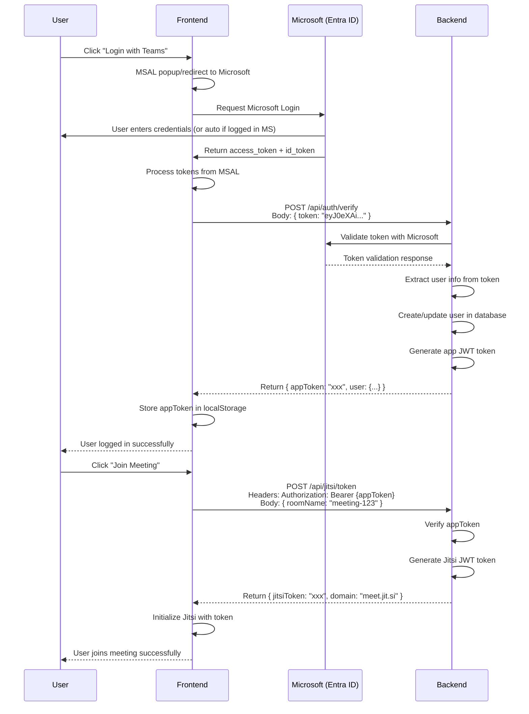
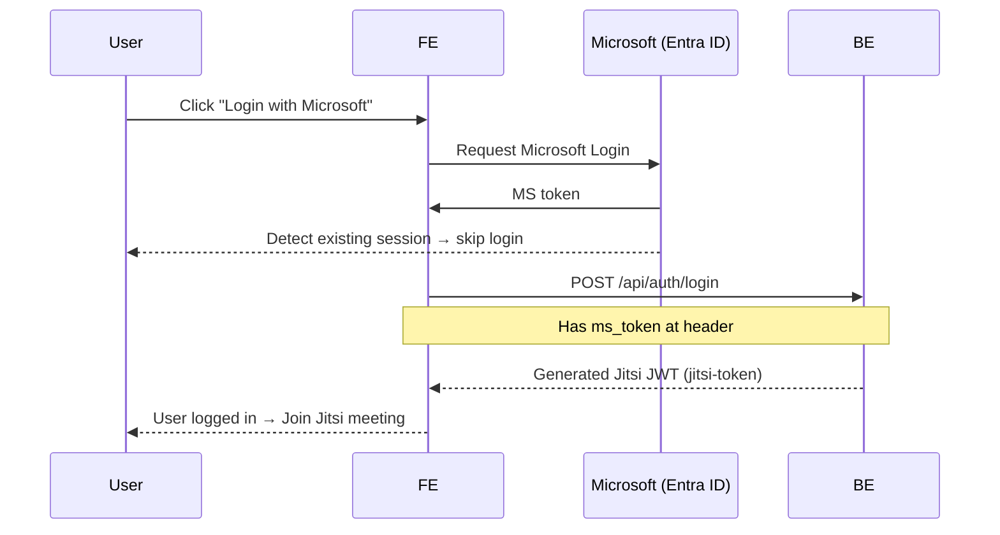
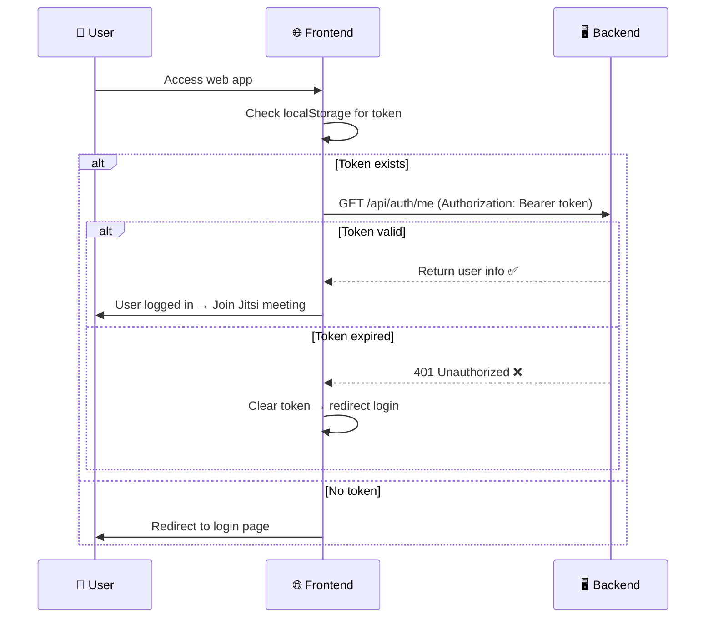

# Flow đăng nhập SSO với Microsoft Teams

## Detailed Authentication Flow

```mermaid
sequenceDiagram
  participant U as User
  participant F as Frontend
  participant M as Microsoft (Entra ID)
  participant B as Backend

  U->>F: Click "Login with Teams"
  F->>F: MSAL popup/redirect to Microsoft
  F->>M: Request Microsoft Login
  M->>U: User enters credentials (or auto if logged in MS)
  M->>F: Return access_token + id_token
  F->>F: Process tokens from MSAL
  F->>B: POST /api/auth/verify<br/>Body: { token: "eyJ0eXAi..." }
  B->>M: Validate token with Microsoft
  M-->>B: Token validation response
  B->>B: Extract user info from token
  B->>B: Create/update user in database
  B->>B: Generate app JWT token
  B-->>F: Return { appToken: "xxx", user: {...} }
  F->>F: Store appToken in localStorage
  F-->>U: User logged in successfully
  U->>F: Click "Join Meeting"
  F->>B: POST /api/jitsi/token<br/>Headers: Authorization: Bearer {appToken}<br/>Body: { roomName: "meeting-123" }
  B->>B: Verify appToken
  B->>B: Generate Jitsi JWT token
  B-->>F: Return { jitsiToken: "xxx", domain: "meet.jit.si" }
  F->>F: Initialize Jitsi with token
  F-->>U: User joins meeting successfully
```

### Trường hợp A — FE login bằng MSAL rồi đổi sang jitsi-token

```mermaid
sequenceDiagram
  participant U as User
  participant F as FE
  participant M as Microsoft (Entra ID)
  participant B as BE

  U->>F: Click "Login with Microsoft"
  F->>M: Request Microsoft Login
  M->>F: MS token
  M-->>U: Detect existing session → skip login

  F->>B: POST /api/auth/login
  Note over F,B: Has ms_token at header

  B-->>F: Generated Jitsi JWT (jitsi-token)
  F-->>U: User logged in → Join Jitsi meeting
```

### Trường hợp 2: User đã có JWT hợp lệ

```mermaid
sequenceDiagram
  participant U as 👤 User
  participant F as 🌐 Frontend
  participant B as 🖥️ Backend

  U->>F: Access web app
  F->>F: Check localStorage for token
  alt Token exists
      F->>B: GET /api/auth/me (Authorization: Bearer token)
      alt Token valid
          B-->>F: Return user info ✅
          F->>U: User logged in → Join Jitsi meeting
      else Token expired
          B-->>F: 401 Unauthorized ❌
          F->>F: Clear token → redirect login
      end
  else No token
      F->>U: Redirect to login page
  end
```
