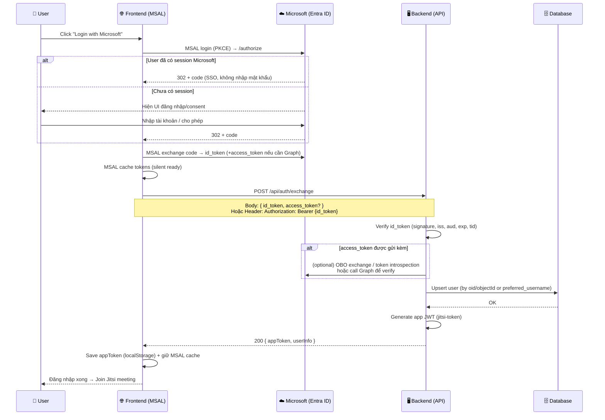
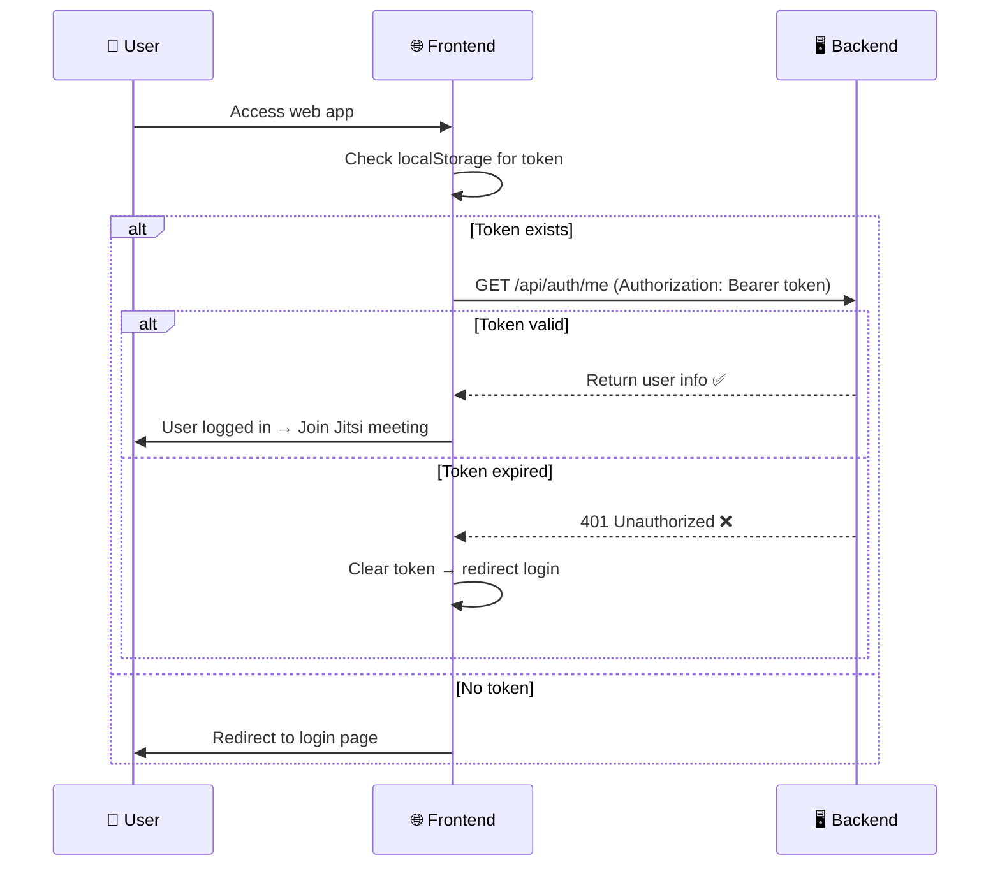

# Flow đăng nhập SSO với Microsoft Teams

## Flow chung

```
┌────────────────────────────┐
│ User open web application  │
└─────────────┬──────────────┘
              │
              ▼
┌──────────────────────────────┐
│ Check localStorage for token │
└─────────────┬────────────────┘
              │
       ┌──────┴──────────┐
       │                 │
       ▼                 ▼
┌──────────────┐   ┌───────────────────────────┐
│ No token     │   │ Token exists               │
│ → Redirect   │   │ Verify with /api/auth/me   │
│ to Login     │   │ Authorization: Bearer JWT  │
└──────────────┘   └──────────────┬────────────┘
                                  │
               ┌──────────────────┴──────────────────┐
               │                                     │
               ▼                                     ▼
   ┌───────────────────────┐            ┌─────────────────────┐
   │ Token valid           │            │ Token expired       │
   │ → User logged in      │            │ → Clear storage     │
   │ → Join meeting        │            │ → Redirect login    │
   └───────────────────────┘            └─────────────────────┘
```

### Trường hợp A — FE login bằng MSAL rồi đổi sang jitsi-token



### Trường hợp 2: User đã có JWT hợp lệ


