```mermaid
sequenceDiagram
  participant U as 👤 User
  participant F as 🌠Frontend
  participant B as ðŸ–¥ï¸ Backend

  U->>F: Access web app
  F->>F: Check localStorage for token
  alt Token exists
      F->>B: GET /api/auth/me (Authorization: Bearer token)
      alt Token valid
          B-->>F: Return user info ✅
          F->>U: User logged in → Join Jitsi meeting
      else Token expired
          B-->>F: 401 Unauthorized âŒ
          F->>F: Clear token → redirect login
      end
  else No token
      F->>U: Redirect to login page
  end
```

# Flow đăng nhập SSO với Microsoft Teams

## Flow chung

```
┌────────────────────────────┐
│ User open web application  │
└─────────────┬──────────────┘
              │
              ▼
┌──────────────────────────────┐
│ Check localStorage for token │
└─────────────┬────────────────┘
              │
       ┌──────┴──────────┐
       │                 │
       ▼                 ▼
┌──────────────┐   ┌───────────────────────────┐
│ No token     │   │ Token exists               │
│ → Redirect   │   │ Verify with /api/auth/me   │
│ to Login     │   │ Authorization: Bearer JWT  │
└──────────────┘   └──────────────┬────────────┘
                                  │
               ┌──────────────────┴──────────────────┐
               │                                     │
               ▼                                     ▼
   ┌───────────────────────┐            ┌─────────────────────┐
   │ Token valid           │            │ Token expired       │
   │ → User logged in      │            │ → Clear storage     │
   │ → Join meeting        │            │ → Redirect login    │
   └───────────────────────┘            └─────────────────────┘
```

## Detailed Authentication Flow


### Trường hợp A — FE login bằng MSAL rồi đổi sang jitsi-token


### Trường hợp 2: User đã có JWT hợp lệ


