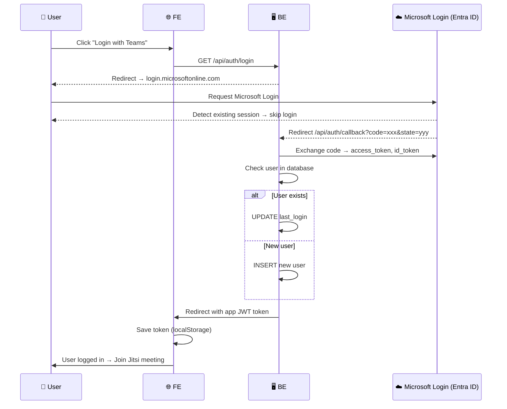

flow

```
┌──────────────────────────┐
│ User click "Login Teams" │
└─────────────┬────────────┘
              │
              ▼
┌──────────────────────────────┐
│ Backend redirect to Microsoft│
│ login.microsoftonline.com    │
└─────────────┬────────────────┘
              │
              ▼
┌────────────────────────────────────┐
│ Microsoft detect valid session     │
│ → Skip login screen (SSO)          │
└─────────────┬──────────────────────┘
              │
              ▼
┌───────────────────────────────────────────────┐
│ Redirect back /api/auth/callback?code=xxx     │
└─────────────┬─────────────────────────────────┘
              │
              ▼
┌───────────────────────────────────────┐
│ Backend exchange code → access_token  │
│ Check DB → Insert/Update user         │
│ Generate app JWT                      │
└─────────────┬─────────────────────────┘
              │
              ▼
┌───────────────────────────────┐
│ Redirect Frontend with token  │
│ Save token → localStorage     │
│ User logged in (1–2s total)   │
└───────────────────────────────┘
```


