# Flow

## Flow chung

```
┌────────────────────────────┐
│ User open web application  │
└─────────────┬──────────────┘
              │
              ▼
┌──────────────────────────────┐
│ Check localStorage for token │
└─────────────┬────────────────┘
              │
       ┌──────┴──────────┐
       │                 │
       ▼                 ▼
┌──────────────┐   ┌───────────────────────────┐
│ No token     │   │ Token exists               │
│ → Redirect   │   │ Verify with /api/auth/me   │
│ to Login     │   │ Authorization: Bearer JWT  │
└──────────────┘   └──────────────┬────────────┘
                                  │
               ┌──────────────────┴──────────────────┐
               │                                     │
               ▼                                     ▼
   ┌───────────────────────┐            ┌─────────────────────┐
   │ Token valid           │            │ Token expired       │
   │ → User logged in      │            │ → Clear storage     │
   │ → Join meeting        │            │ → Redirect login    │
   └───────────────────────┘            └─────────────────────┘
```



```mermaid
sequenceDiagram
    participant U as 👤 User
    participant F as 🌐 FE
    participant B as 🖥️ BE
    participant M as ☁️ Microsoft Login (Entra ID)

    U->>F: Click "Login with Teams"
    F->>B: GET /api/auth/login
    B-->>U: Redirect → login.microsoftonline.com
    U->>M: Request Microsoft Login
    M-->>U: Detect existing session → skip login
    M-->>B: Redirect /api/auth/callback?code=xxx&state=yyy
    B->>M: Exchange code → access_token, id_token
    B->>B: Handle logic
    B->>F: Redirect Jitsi JWT token
    F->>F: Save token (localStorage)
    F->>U: User logged in → Join Jitsi meeting
```

### Trường hợp 1: User chưa đăng nhập app (Login with Teams)

```mermaid
sequenceDiagram
    participant U as 👤 User
    participant F as 🌐 Frontend
    participant B as 🖥️ Backend
    participant M as ☁️ Microsoft Login (Entra ID)

    U->>F: Click "Login with Teams"
    F->>B: GET /api/auth/login
    B-->>U: Redirect → login.microsoftonline.com
    U->>M: Request Microsoft Login
    M-->>U: Detect existing session → skip login
    M-->>B: Redirect /api/auth/callback?code=xxx&state=yyy
    B->>M: Exchange code → access_token, id_token
    B->>B: Check user in database
    alt User exists
        B->>B: UPDATE last_login
    else New user
        B->>B: INSERT new user
    end
    B->>F: Redirect with app JWT token
    F->>F: Save token (localStorage)
    F->>U: User logged in → Join Jitsi meeting

```



```
┌──────────────────────────┐
│ User click "Login Teams" │
└─────────────┬────────────┘
              │
              ▼
┌──────────────────────────────┐
│ Backend redirect to Microsoft│
│ login.microsoftonline.com    │
└─────────────┬────────────────┘
              │
              ▼
┌────────────────────────────────────┐
│ Microsoft detect valid session     │
│ → Skip login screen (SSO)          │
└─────────────┬──────────────────────┘
              │
              ▼
┌───────────────────────────────────────────────┐
│ Redirect back /api/auth/callback?code=xxx     │
└─────────────┬─────────────────────────────────┘
              │
              ▼
┌───────────────────────────────────────┐
│ Backend exchange code → access_token  │
│ Check DB → Insert/Update user         │
│ Generate app JWT                      │
└─────────────┬─────────────────────────┘
              │
              ▼
┌───────────────────────────────┐
│ Redirect Frontend with token  │
│ Save token → localStorage     │
│ User logged in (1–2s total)   │
└───────────────────────────────┘
```

### Trường hợp 2: User đã có JWT hợp lệ


```
┌────────────────────────────┐
│ User open web application  │
└─────────────┬──────────────┘
              │
              ▼
┌──────────────────────────────┐
│ Check localStorage for token │
└─────────────┬────────────────┘
              │
       ┌──────┴──────────┐
       │                 │
       ▼                 ▼
┌──────────────┐   ┌───────────────────────────┐
│ No token     │   │ Token exists               │
│ → Redirect   │   │ Verify with /api/auth/me   │
│ to Login     │   │ Authorization: Bearer JWT  │
└──────────────┘   └──────────────┬────────────┘
                                  │
               ┌──────────────────┴──────────────────┐
               │                                     │
               ▼                                     ▼
   ┌───────────────────────┐            ┌─────────────────────┐
   │ Token valid           │            │ Token expired       │
   │ → User logged in      │            │ → Clear storage     │
   │ → Join meeting        │            │ → Redirect login    │
   └───────────────────────┘            └─────────────────────┘

```
