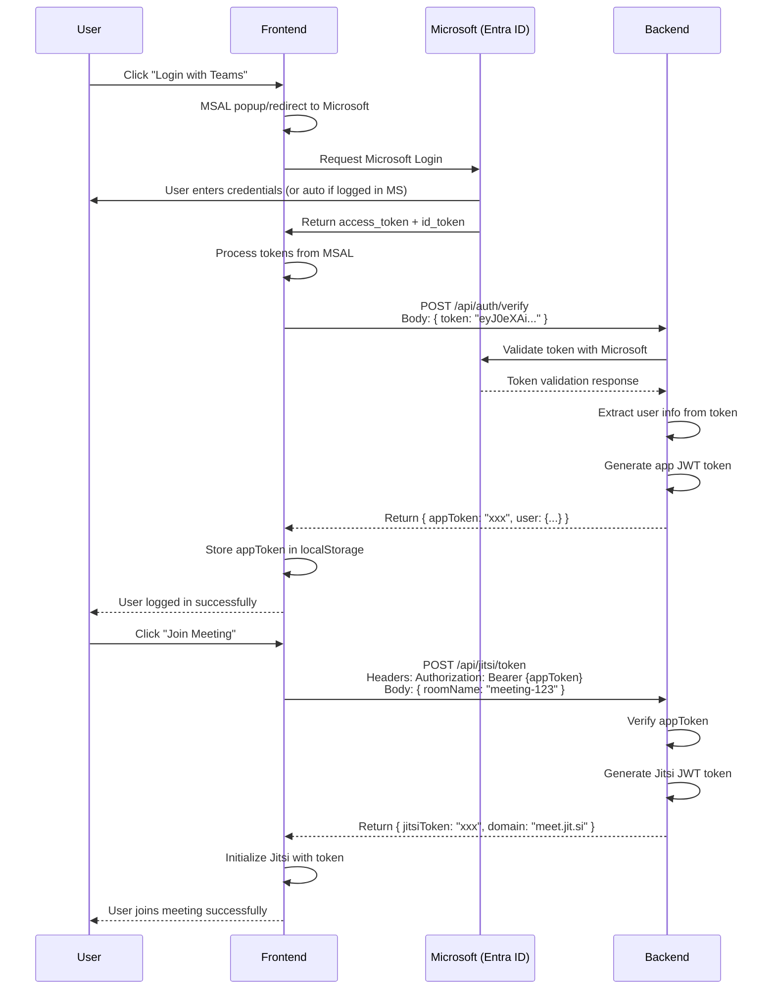

# Flow đăng nhập SSO với Microsoft Teams

```
1. User click "Login with Teams" trên web
  ↓
2. **Frontend sử dụng MSAL để login**
  - MSAL popup/redirect đến Microsoft
  - User nhập username/password (hoặc auto nếu đã login MS)
  - Microsoft trả về access_token + id_token cho Frontend
  ↓
3. Frontend nhận được tokens từ MSAL
  ↓
4. **Frontend gửi id_token/access_token cho Backend**
  POST /api/auth/verify
  Body: { token: "eyJ0eXAi..." }
  ↓
5. Backend xử lý:
  - Validate token từ Microsoft
  - Extract user info
  - Tạo/update user trong database
  - Generate JWT token của app
  - Return: { appToken: "xxx", user: {...} }
  ↓
6. Frontend lưu appToken vào localStorage
  ↓
7. **Frontend gọi API tạo Jitsi token**
  POST /api/jitsi/token
  Headers: Authorization: Bearer {appToken}
  Body: { roomName: "meeting-123" }
  ↓
8. Backend:
  - Verify appToken
  - Generate Jitsi JWT token
  - Return: { jitsiToken: "xxx", domain: "meet.jit.si" }
  ↓
9. Frontend khởi tạo Jitsi với token
  ↓
10. User join meeting thành công
```

## Detailed Authentication Flow


